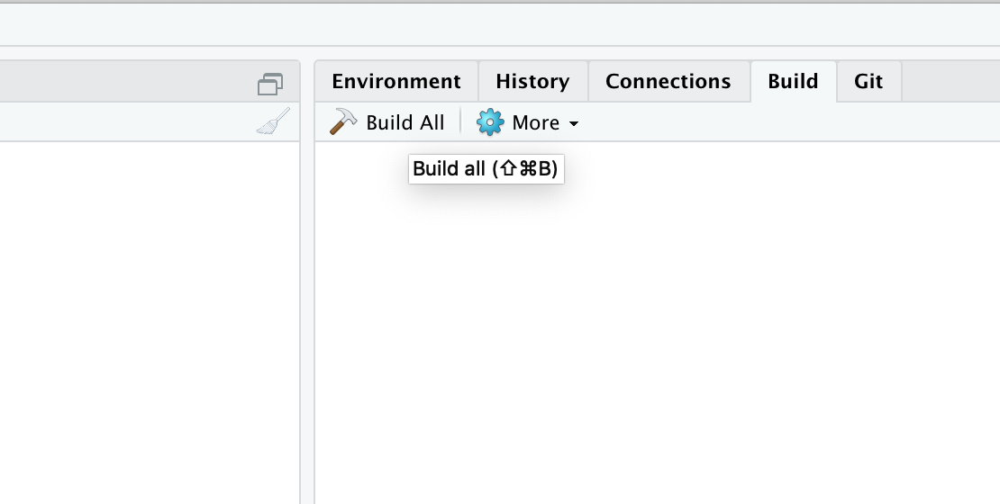

# Oxforddown
A template for writing an Oxford University thesis in R Markdown.

See the video tutorials for how to use the template:
- [Part 1: Building the entire thesis](https://www.youtube.com/watch?v=Yf1W1BBS9cU)
- [Part 2: Building a single chapter](https://www.youtube.com/watch?v=-EJfCA3VA-I)
- [Part 3: Understanding the file structure](https://www.youtube.com/watch?v=jafgJobOgpc)
- [Part 4: A walk-through example of creating your thesis](https://www.youtube.com/watch?v=uWpinaVSZ6Q)
- [Part 5: The content included in index.Rmd (or: why the introduction chapter is special)](https://www.youtube.com/watch?v=FPlwCj5ZH8M)
- [Part 6: Adjusting the order of chapters](https://www.youtube.com/watch?v=-0M3TuDnu7Y)
- [Part 7: \_bookdown.yml: Adjusting build settings](https://www.youtube.com/watch?v=jXYfC8RXTvg)
- [Part 8: Makefile: Adjusting build settings](https://www.youtube.com/watch?v=L6mV8z32RfE)
- [Part 9: The LaTeX templates](https://www.youtube.com/watch?v=o2fd_O1On7g)


For how to write your content with the R Markdown syntax, read through the sample content.

The template uses the [bookdown](https://bookdown.org) R package together with the [OxThesis LaTeX template](https://github.com/mcmanigle/OxThesis), plus lots of inspiration from [thesisdown](https://github.com/ismayc/thesisdown).

## Examples of theses written with `oxforddown`

- [Teens, Screens and Wellbeing: An Improved Approach](https://www.amyorben.com/docs/thesis/index.html) by [Amy Orben](https://www.amyorben.com)

*NOTE: If you've used this template to write your thesis, drop me a line at ulrik.lyngs@cs.ox.ac.uk and I'll add a link showcasing it!*

## How to cite
[](https://zenodo.org/badge/latestdoi/159745024)

```bibtex
@misc{lyngsOxforddown2019,
  author = {Lyngs, Ulrik},
  title = {oxforddown},
  year = {2019},
  publisher = {GitHub},
  journal = {GitHub repository},
  howpublished = {\url{https://github.com/ulyngs/oxforddown}},
  doi = {10.5281/zenodo.3484682},
}
```

# Requirements
- LaTeX - if you're lazy and got sufficient disc space, just download and install the MacTeX distribution from [tug.org/mactex/](http://www.tug.org/mactex/). If you're short on disc space, go for the BasicTeX distribution from the same site. 
  - (For unclear reasons, Yihui Xie's [TinyTeX](https://yihui.name/tinytex/) sometimes causes trouble! If you are unable to get the PDF output to work with TinyTex, try uninstalling it with tinytex::uninstall_tinytex(), then install the MacTeX LaTeX distribution and restart RStudio.)
- [R](https://cran.rstudio.com) and [RStudio version 1.2 or higher](https://www.rstudio.com/products/rstudio/download/#download)
  - (pandoc version 2 or higher - comes bundled with RStudio v1.2+)
- The R packages `bookdown`, `tidyverse`and `kableExtra` (should be automatically installed for you if you don't already have them, when you build this project for the first time in RStudio)
- (If on a Mac): Command line developer tools. You can install these by typing `xcode-select --install` in a terminal prompt

# Example output
- PDF output: see [**docs/_main.pdf**](https://github.com/ulyngs/oxforddown/blob/master/docs/_main.pdf)
- Gitbook output: see [ulyngs.github.io/oxforddown/](https://ulyngs.github.io/oxforddown/)

# Usage
- clone the **ulyngs/oxforddown** repo or download it as a zip
- open **oxforddown.Rproj** in RStudio

## Compiling your thesis
### PDF output
- click 'Build All' on the 'Build' tab *or* type 'make pdf' in the terminal (not the R console!)
- the compiled PDF is saved as **docs/\_main.pdf**, and the PDF is opened




### Gitbook output
- in the terminal tab (not the R console!), type 'make gitbook'
- the set of HTML files for the gitbook are stored in the **docs/** folder, and the front page (docs/index.html) is opened in a browser
- if you want to deploy your thesis as a gitbook on GitHub Pages, then make sure that there's a **.nojekyll** file in the **docs/** folder (otherwise GitHub does some voodoo that causes some paths not to work)


### Word output
- in the terminal tab (not the R console!), type 'make word'
- the compiled MS Word document is saved as **docs/\_main.docx** and opened

The Word output has no template behind it, and many things do not work (e.g. image rotation, highlighting corrections). **I encourage pull requests that optimise the Word output, e.g. by using tools from the [`officer`](https://github.com/davidgohel/officer) package.**

## Writing your thesis
To use this template to write your thesis, do the following:
- update the YAML header (the stuff at the top between '---') in **index.Rmd** with your name, college, etc.
- write the individual chapters as **.Rmd** files in the root folder - **the introduction chapter *must* be named _00-introduction.Rmd**.
- write the front matter (abstract, acknowledgements, abbreviations) and back matter (appendices) by adjusting the **.Rmd** files in the **front-and-back-matter/** folder
- for abbreviations, change **front-and-back-matter/abbreviations.tex** to fit your needs (follow the LaTeX syntax in there)

**.Rmd** files you don't want included in the body text must be given file names that begin with an underscore (e.g. **front-and-back-matter/\_abstract.Rmd** and **front-and-back-matter/\_acknowledgements.Rmd**). (Alternatively, specify manually in **\_bookdown.yml** which files should be merged into the body text.)

## Knitting individual chapters
To knit an individual chapter without compiling the entire thesis:
1. open the **.Rmd** file of a chapter
2. add a YAML header specifying the output format(s) (e.g. `bookdown::word_document2` for a word document you might want to upload to Google Docs for feedback from collaborators)
  - To output a single chapter to PDF, use `bookdown::pdf_documents2: template: templates/brief_template.tex` - this will format the chapter in the OxThesis style but without including the front matter (table of contents, abstract, etc)

The output file is saved in the root folder.

## Cleaning up generated auxiliary files
By default, when you build the entire thesis, the auxillary files will be removed (to adjust how this is done, edit **Makefile**).

To clean up files generated when knitting individual chapters, type 'make clean-knits' in the terminal.

# Limitations
## Gotchas
- don't use underscores (\_) in your YAML front matter or code chunk labels! (underscores have special meaning in LaTeX, so therefore you are likely to get an error, cf. https://yihui.org/en/2018/03/space-pain/)
  - bad YAML: `bibliography: bib_final.bib`
  - good YAML: `bibliography: bib-final.bib`
  - bad chunk label: `{r my_plot}`
  - good chunk label: `{r my-plot}`
- if you want to deploy the gitbook via GitHub pages, then the /docs folder must contain a file called **.nojekyll**

## Output formats
- at the moment only PDF and HTML output have been properly implemented; I may improve on the Word output further down the line

Enjoy!
